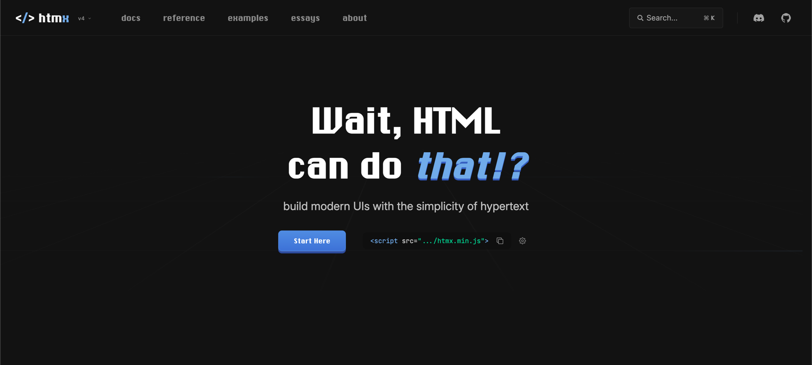
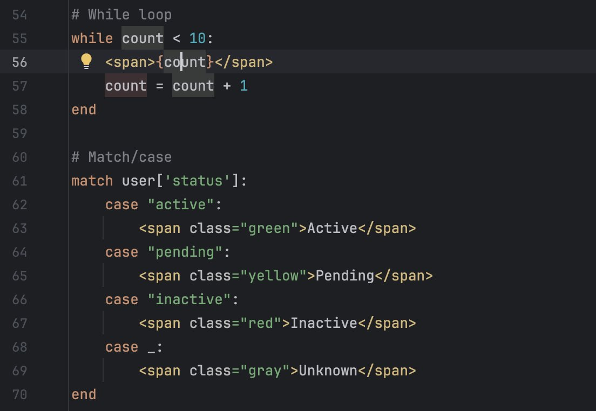
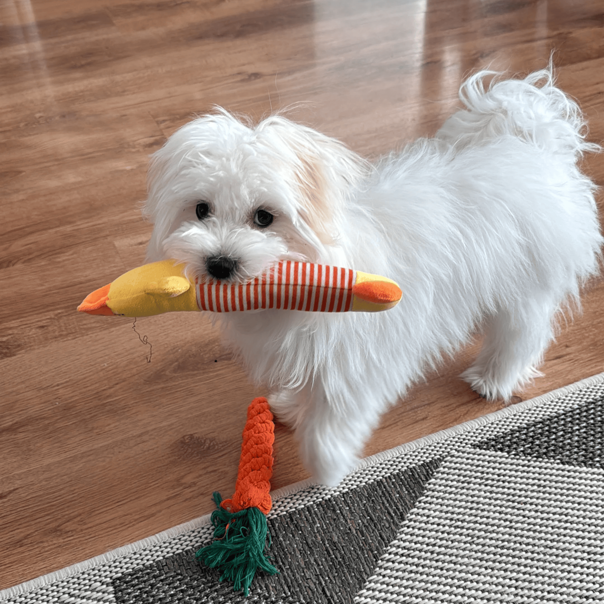

# Christian Tanul

I'm a full-stack developer with ~7 years of experience.

I build stuff. Sometimes for clients, sometimes for myself, sometimes just to see if I can.

I self-host most of my projects.

## Projects

#### htmx

Redesigned the [website](https://four.htmx.org), contributed the `<hx-partial>` tag and built-in SSE support.

#### hyper

Building a templating language that combines Python & HTML.

#### Expert Systems

Built ML/LLM tools for a drug discovery team in New Mexico, USA.

Co-authored a paper with [Prof. Tudor Oprea](https://www.linkedin.com/in/tudorioprea).

#### **intreabalegea.ro**

Built a RAG tool for free legal guidance to Romanian citizens.

Started as a Golang learning project.

#### **roastroulette.io**

Built an [open-source](https://github.com/scriptogre/roast-roulette) multiplayer party game. Upload photos, get roasted by an LLM. 

Built to play with my friends during weekends.

Spits gems at times:

#### Homelab

I'm a home lab nerd with a personal cloud: files, photos, calendar, DNS, media servers, etc. 

Runs on several Synology NAS(es?), a ThinkCentre M90Q Gen 4, and a Raspberry Pi 5.

Saves money. Taught me sysadmin stuff. Made me a NixOS convert.

### How I Work

Mostly alone.

[htmx](https://htmx.org/) over React, [Caddy](https://caddyserver.com/) over Nginx, [Tailscale](https://tailscale.com/) over classic VPNs. CSS over JS when possible.

I like turning complex things simple.

## Talks

### Lightning Talk @ DjangoCon 2025: Roast Roulette Live Demo

Played a round of Roast Roulette with the audience.

My Pi died, so I improvised and had 70 people connect directly to my MacBook (lol).

### Workshop @ DjangoCon 2024: Functional Chatbots

Workshop about connecting LLMs to web apps (using htmx).

Spent over 2 months preparing the repository. Check it out, if you're interested.

- **Repository**: [github.com/scriptogre/functional-chatbots](http://github.com/scriptogre/functional-chatbots)
- **Video**: [YouTube](https://www.youtube.com/watch?v=jtjMR47AAd8)

### Lightning Talk @ PyCON SK 2024: ChatGPT + Streamlit

Lightning talk about prototyping with ChatGPT and Streamlit.

## Etc.

Believer, married & father (soon).

Got a dog. She's a good girl.

Self-taught. Passionate about what I do, and I put my heart into all of it.

Fun station:

## Contact

📧 [contact@christiantanul.com](mailto:contact@christiantanul.com)

Feel free to reach out.
