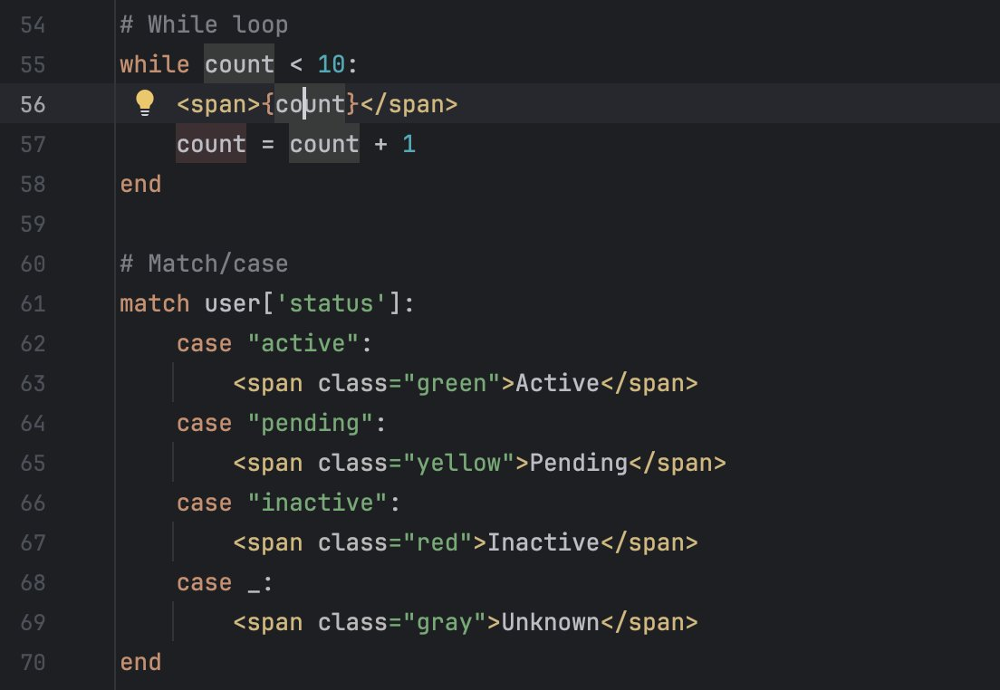

# Christian Tanul

I'm a software developer with ~8 years of experience.

#### htmx

I'm a core contributor to [htmx](https://github.com/bigskysoftware/htmx).

I brought the [new website](https://four.htmx.org), the new `<hx-partial>` tag, and better real-time (WS/SSE) integration.

#### hyper ([try it out](https://github.com/scriptogre/hyper))

I built a templating engine that enables writing a minimalist Python + HTML syntax.

It's my small passion project, something I always wanted in Python: server-side type-safe components with a modern DX. 

It uses a Rust transpiler that turns `.hyper` files into ready to import Python functions. It also comes with proper tooling via IDE plugins.

#### intreabalegea.ro ([try it out](https://staging.intreabalegea.ro))

I'm building an open-source [public dataset of Romanian laws](https://github.com/scriptogre/romanian-law-data), and an [LLM platform](https://staging.intreabalegea.ro) that uses it as a foundation.

I do this because Romanian law is notoriously complex, and publicly available data is unstructured & noisy.

It is freely available for Romanian citizens.

#### WASM Fantasia ([try it out](https://game.christiantanul.com) / [source code](https://github.com/scriptogre/wasm-fantasia))

I'm working on a multiplayer roguelite game running in the browser (using WASM).

It uses [SpacetimeDB](https://spacetimedb.com/) for the (authoritative) server-side & [Bevy](https://bevy.org/) for the client-side.

It's currently an early prototype.

#### Hyperspace ([try it out](https://hyperspace.christiantanul.com) / [source code](https://github.com/scriptogre/hyperspace))

I built another multiplayer game (?) as an experiment trying to find the limits of real-time hypermedia (using htmx 😎).

It uses a [patched version](https://github.com/scriptogre/SpacetimeDB/tree/hypermedia) of [SpacetimeDB](https://spacetimedb.com/) that enables streaming HTML directly from the database. 

Every user action is synced to the DB & streamed to connected users. The entire "stack" is SpacetimeDB + a .jinja2 template. 

It might feel laggy until I add client-side prediction.

#### Roast Roulette ([try it out](https://roastroulette.christiantanul.com) / [source code](https://github.com/scriptogre/roast-roulette))

I also built YET ANOTHER multiplayer party game (using htmx 😎) where you can upload photos and get roasted by an LLM. 

#### Homelab

I love wasting time on my homelab. I keep my own cloud and self-host most of my projects.

It saved me money, and made me both love & hate NixOS.

#### Expert Systems

I've worked on ML/LLM tools for a drug discovery team in New Mexico, USA, and co-authored a paper with [Prof. Tudor Oprea](https://www.linkedin.com/in/tudorioprea).

## Talks

### Talk @ Big Sky Dev Con 2026 (Upcoming)

I will be giving a talk at Big Sky Dev Con 2026 called **Real-Time Hypermedia (the htmx way)**.

Stay tuned 😃

### Lightning Talk @ DjangoCon 2025: Roast Roulette Live Demo

I presented (& played) Roast Roulette with the audience at DjangoCon 2025.

My Pi died, so I had 70 people connect directly to my MacBook (lol).

### Workshop @ DjangoCon 2024: Functional Chatbots

I presented a workshop on connecting LLMs to web apps at DjangoCon 2024.

Check it out, if you're interested.

- **Repository**: [github.com/scriptogre/functional-chatbots](http://github.com/scriptogre/functional-chatbots)
- **Video**: [YouTube](https://www.youtube.com/watch?v=jtjMR47AAd8)

### Lightning Talk @ PyCON SK 2024: ChatGPT + Streamlit

I presented a brief lightning talk about prototyping with ChatGPT & Streamlit at PyCON SK 2024.

## Other

I'm a christian, a husband, and (soon) a father.

I'm also Luna's father 🐶.

I'm passionate about what I do, and I put my heart into it.

This is where I spend most of my hours:

## Contact

📧 [contact@christiantanul.com](mailto:contact@christiantanul.com)

Feel free to reach out.
