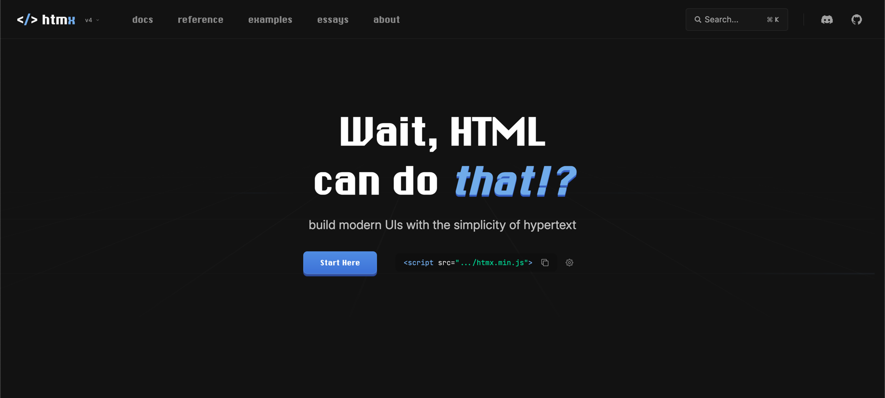
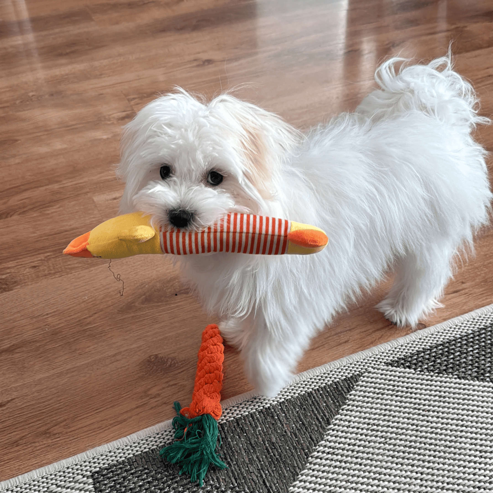

# Christian Tanul

I'm (mainly) a full-stack developer with ~7 years of experience.

## Projects

#### htmx

Lately I've been contributing to htmx full-time, bring in a [new website](https://four.htmx.org), and some new features like the `<hx-partial>` tag.

#### hyper

I'm trying to build a modern DX for creating SSR templates in Python. I built a Rust transpiler to turn Python + HTML syntax into optimized Python, and IDE plugins to go along with it.

#### Expert Systems

I've worked on ML/LLM tools for a drug discovery team in New Mexico, USA, and co-authored a paper with [Prof. Tudor Oprea](https://www.linkedin.com/in/tudorioprea).

#### **intreabalegea.ro**

I built a RAG tool for analyzing the latest Romanian laws.

#### **roastroulette**

I also built a [multiplayer party game](https://github.com/scriptogre/roast-roulette) (using htmx) where you can upload photos and get roasted by an LLM. 

(I just wanted something fun to play with my peers during weekends)

#### Homelab

I host a personal cloud: files, photos, calendar, DNS, media servers, etc.

I also self-host most of my projects.

Saved me money, taught me sysadmin stuff, and made me a NixOS convert.

## Talks

### Lightning Talk @ DjangoCon 2025: Roast Roulette Live Demo

Played Roast Roulette with the audience.

My Pi died, so I had 70 people connect directly to my MacBook (lol).

### Workshop @ DjangoCon 2024: Functional Chatbots

Presented a workshop on connecting LLMs to web apps (using htmx).

Check it out, if you're interested.

- **Repository**: [github.com/scriptogre/functional-chatbots](http://github.com/scriptogre/functional-chatbots)
- **Video**: [YouTube](https://www.youtube.com/watch?v=jtjMR47AAd8)

### Lightning Talk @ PyCON SK 2024: ChatGPT + Streamlit

Presented a lightning talk about prototyping with ChatGPT and Streamlit.

## Other

Christian, husband & father (soon).

Got a dog. She's a good girl.

Passionate about what I do, and I put my heart into all of it.

This is my workstation:

## Contact

📧 [contact@christiantanul.com](mailto:contact@christiantanul.com)

Feel free to reach out for consulting.
